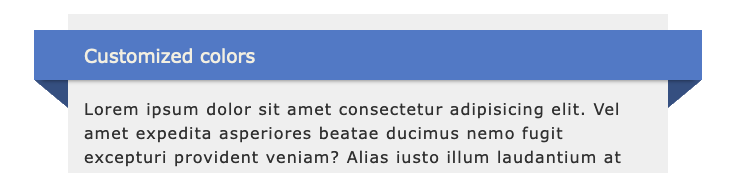

# wraparound

Creates a visual effect on elements that makes them appear to be animated in 3D when the page is scrolled.

Usage:
* Make sure the files (or just their contents) `wraparound.js` and `wraparound.css` are loaded on your page
* Add CSS class `wraparound` to the target elements
* Adjust the styles as needed to fit your theme

[See the demo](http://tapiocode.github.io/wraparound/)

# License

MIT License
